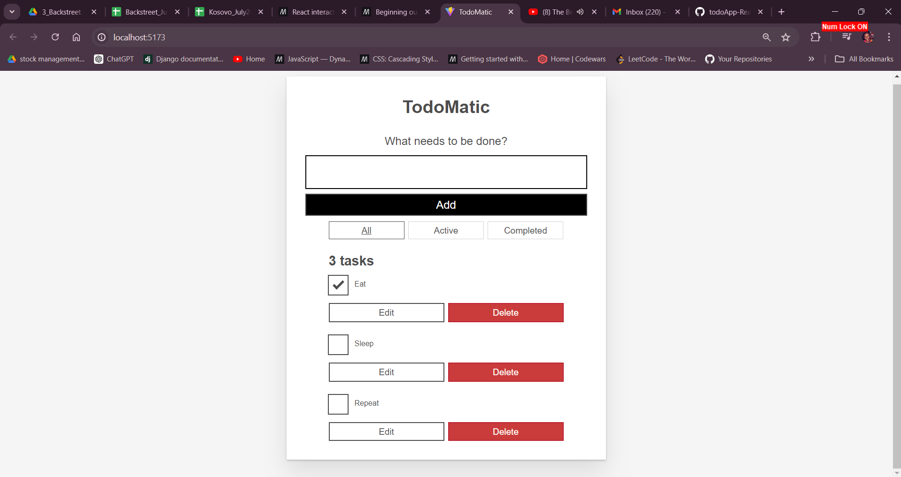

# Learn React with a Todo App

Dive into basics and advanced concepts of ReactJs using a todo app.

Reference: mdn docs 
https://developer.mozilla.org/en-US/docs/Learn/Tools_and_testing/Client-side_JavaScript_frameworks/React_todo_list_beginning

### Concepts
1. Jsx
2. components
3. state
4. props
5. Syncing state data and UI techniques such as two-way binding for inputs, maps and filters e.t.c
6. conditional rendering using boolean states
7. dealing with constants
8. call back functions and event handling.
9. Styling with CSS classes
10. Basics of Accessible Rich Internet application(ARIA) principles
11. Use of createContext and useContext hooks for sharing state and data across components to avoid excessive prop drilling